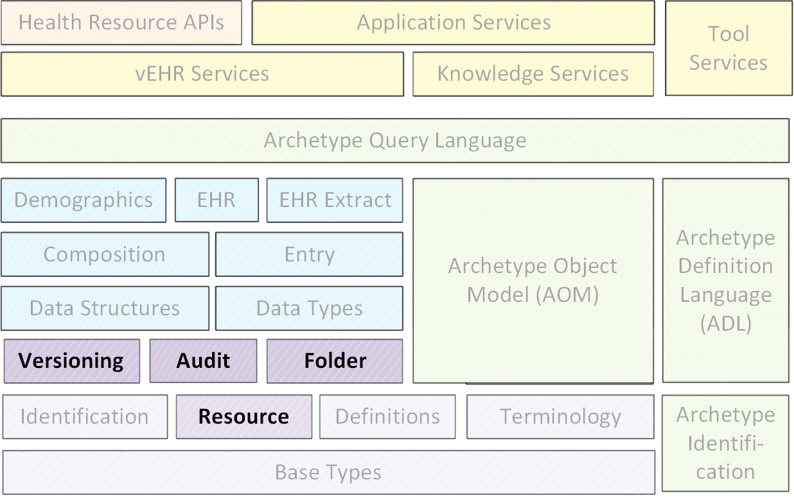

//
// ============================================ Asciidoc HEADER =============================================
//
:doctype: book
:source-highlighter: pygments
:pygments-style: murphy
//:toc: macro
:toc: left
:toclevels: 4
:pagenums:
:numbered!:
// git rid of PDF 'Chapter' labs on level 1 headings
:chapter-label:
:copyright_year: 2003
//
// HTML-only attributes
//
:linkcss:
:keywords: common, EHR, reference model, openehr
:description: openEHR Common Information Model specification

//
// ============================================ Asciidoc PREAMBLE =============================================
//

image::{resources_dir}/images/openehr_logo_large.png["openEHR logo",align="center"]

= Common Information Model

[cols="1,1,1"]
|===
3+^|*Issuer*: http://www.openehr.org/programs/specification/[openEHR Specification Program]

|*Revision*: <<latest_issue>>
|*Date*: <<latest_issue_date>>
|*Status*: STABLE

3+^|*Keywords*: {keywords}
|===

 

include::{resources_dir}/boilerplate/licence_block.adoc[]

//
// ============================================= Asciidoc BODY ===============================================
//

include::master00-amendment_record.adoc[leveloffset=+1]

//
// --------------------------------------------- Preface -----------------------------------------------
//
== Acknowledgements
The work reported in this paper has been funded in by a number of organisations, including The University College, London; The Cooperative Research Centres Program through the Department of the Prime Minister and Cabinet of the Commonwealth Government of Australia; Ocean Informatics, Australia.

=== Trademarks

* 'openEHR' is a trademark of the openEHR Foundation
* 'Java' is a registered trademark of Oracle Corporation
* 'Microsoft' is a trademark of the Microsoft Corporation

//
// --------------------------------------------- TOC -----------------------------------------------
//
//toc::[left]

//
// --------------------------------------------- CHAPTERS -----------------------------------------------
//
:numbered:
include::master01-introduction.adoc[leveloffset=+1]
include::master02-overview.adoc[leveloffset=+1]
include::master03-archetyped_package.adoc[leveloffset=+1]
include::master04-generic_package.adoc[leveloffset=+1]
include::master05-directory_package.adoc[leveloffset=+1]
include::master06-change_control_package.adoc[leveloffset=+1]
include::master07-resource_package.adoc[leveloffset=+1]

//
// --------------------------------------------- REFERENCES -----------------------------------------------
//
:numbered!:
== References
include::../references/publications.adoc[leveloffset=+1]
include::../references/resources.adoc[leveloffset=+1]
include::../references/openehr_resources.adoc[leveloffset=+1]
