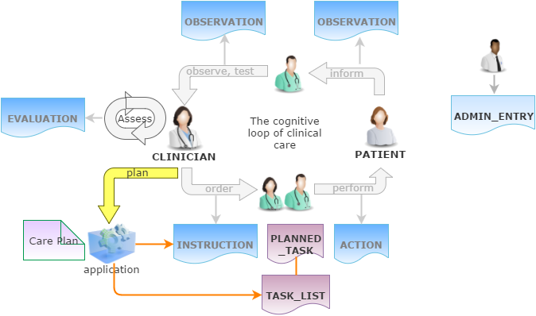

= Task Planning

The Entry model described in the previous section defines a way to record clinical statements representing real observations, decisions, orders and actions that have occurred, into the EHR. In this scheme, Actions and Observations represent events that have occurred in the real world - a real drug administration or an actual blood sugar measurement. Instructions represent orders for certain kinds of Actions to be performed. There is however a common additional need to concretely plan Actions and sometimes Observations out in time, as a set of tasks. The general concept is usually known as a _task list_, and is used to concretely specify actions to be performed by actors (usually human, but potentially machine as well) providing care.

To meet this need, a further kind of content can be recorded in the EHR, representing planned tasks.

The overall design concept described here considers Task Lists as the lower part of an overall architecture that includes entities at multiple levels, i.e.:

* Care Pathway - a model of a guideline for care of a condition / ideal patient;
* Care Plan - a plan for concrete care of an actual patient, taking into account zero or more Care Pathways and individual specificities;
* Task List - an instance level concept that defines a list of Tasks to perform over time.

We can visualise this conceptually with a modified version of the Clinical Investigator process diagram as follows:

[.text-center]
.Clinical Investigator Process with Planning

The design described here does not address the representation of the Care Pathway or Care Plan levels, only the Task List level. It is assumes that a Task List is normally created due to a Care Plan of some kind, and that the Care Plan may in turn have been derived from one or more Care Pathways. 

== Requirements

=== Full Plan

The simplest need is to be able to post a full plan of all Actions to be performed for an order (represented by an `INSTRUCTION`), in advance of the order commencing. One difficulty with posting a full plan is that in some cases, the order is considered open-ended, i.e. it has no intended completion. This might be because the patient condition being treated is chronic, e.g. an insulin or Salbutamol (Ventolin) order; or it might be that although the condition is assumed to be limited in time, no current assumption can be made about when, e.g. pain medication of a trauma victim.

=== Lookahead Plan

A more flexible version of planning an ongoing order is 'lookahead' planning, i.e. posting a plan of Actions for a moving window in time, e.g. one day, a few days, a few nursing rotations etc. The idea here is not to try to plan out the entire order execution, since it can easily change or be stopped, e.g. due to change in patient or other unexpected events. In a lookahead approach, posted Actions are executed, and more planned Actions are posted. The planned timing of each set of Actions may change due to the current situation, with the effect that the overall set of Actions that unfolds in time may well be different from an attempt to post all Actions as per the 'full plan' idea.

For the open-ended cases mentioned above, the only option is a lookahead plan that extends as far ahead in time as the treating physicians are prepared to go.

=== Checklist & Sign-off

If a Task list is created, the constituent Tasks (typically Actions) can be viewed by workers as a checklist, and subsequently signed off as having been performed over time. The utility of this is that the correspondence between Actions (Observations etc) actually performed and those planned is established. If a planned Action A1 is posted with execution time T, it might actually be performed at time T', but we still want to know that it was planned Action A1 that was intentionally performed, and not some other Action in the Task list. Over the course of the order execution, a picture will emerge of planned Actions being performed and signed off, possibly with some being missed as not needed, or not done for some other reason. Additional Actions not originally posted in the plan might also be done if they are allowed by the general specification of the relevant archetype.

=== Major Changes and Abandonment

Inevitably, some Task lists will have to be changed or abandoned partway through due to unexpected changes in the patient situation. The question here is: what should be done with the remaining posted Actions that will not be performed? Should they be marked as 'won't do' (with some reason) and committed to the EHR, or should they be deleted prior to being committed to the EHR?

It is assumed that the answer will differ according to circumstance and local preference, in other words, that planned Tasks that are created are not necessarily written into the EHR, but may initially exist in a separate 'planned tasks' buffer, and are only committed when a) the Task is performed or b) explicitly marked as not done or c) included in a list of not-done Actions to be committed to the EHR at a point of plan abandonment.

=== Generate Analytics Data

As Actions are performed and signed off on the list of posted planned Actions, there will generally be differences between Actions actually performed and those on the planned list. Differences could include:

* time of execution - this will almost always be different, even if only by minutes
* performer - an Action intended to be performed by a specific type of actor (say a nurse) might be performed by another (say the consultant)
* any other modifiable detail of the order, typically medication dose in bedside care situations.

These differences are recorded in the EHR since both planned and performed Actions will appear, providing a data resource for analysing business process, order compliance, reasons for deviation and so on.

=== Plans for Order Sets

A plan for execution of an order might need to encompass more than one order, in situations where drugs and other therapies are used according to a protocol or regime. For example, Vincristine is typically used in chemotherapy with other drugs according to protocols like CHOP (non-Hodgkin's lymphoma), COPP or Stanford V (Hodgkin's lymphoma) etc. A plan for using Vincristine in the CHOP protocol for example would need to be a plan for structured doses of \(C\)yclophosphamide, (H)ydroxydaunorubicin, (O)ncovin (= Vincristine), and (P)rednisolone.

== Design Paradigm

The design approach adopted here is based on the idea of three phases of an intervention, namely Order, Planned action, Action (here we assume that 'action' may be an openEHR `ACTION`, `OBSERVATION`, or possibly some other kind of clinical information type). There are correspondingly three levels of representation, two of which already exist, as follows:

* `INSTRUCTION`: statement of an order in a formulaic way, e.g. corresponding to "Amoxycillin 3 td po x 7d" (3 times a day, orally, for 7 days);
* `PLANNED_ACTION`: representation of a single executable step in the order, e.g. a single dose administration of a drug;
* `ACTION`: statement of the step that was actually executed by the performer.

The model described here adds the second level of representation, which enables fine-grained lists of executable tasks to be explicitly stated and therefore stored in the EHR, displayed, and signed off.

== Planned Task Model

The following figure shows the `rm.composition.planning` package, including its relationships to existing classes.

[.text-center]
.rm.composition.planning package
image::{uml_export_dir}/diagrams/RM-composition.planning.svg[id=rm_composition_planning, align="center"]

The central classes in this model are `TASK_LIST` and `PLANNED_TASK`, which define a list of Tasks and a single Task respectively. The abstract parent class `PLAN_ITEM` is used to provide these two classes with various attibutes that may apply both to a list of Tasks and single Task. As stated earlier, the notion of Task in this model is at the bottom of three conceptual levels. Accordingly, it does not attempt to define semantics of Care Plans or Care Pathways, but it does provide attributes to record a guideline and care plan identifier(s) (`PLAN_ITEM._guideline_id_` and `TASK_LIST._care_plan_` respectively). 

=== Execution-time Data Structures

In this model a `TASK_LIST` is required in order to define any `PLANNED_TASKs`. Accordingly, `TASK_LIST` inherits from `CONTENT_ITEM`, the abstract type of the `_content_` attribute of a `COMPOSITION`. A `TASK_LIST` and its constituent `PLANNED_TASKs` are assumed to be created within a single dedicated `COMPOSITION` which is re-versioned as changes are made to its contents. New versions will occur for the following reasons:

* update / add to `TASK_LIST`, mainly due to extension of the lookahead planning window;
* cancellation of tasks;
* addition of forward references to tasks that have been performed and recorded (i.e. `ACTIONs`, `OBSERVATIONs`, ?`EVALUATIONs` e.g. review); = task item signoff;
* completion or abandonment of the Task list.

As the `TASK_LIST` gets progressively built and performed over time, its owning `COMPOSITION` will potentially undergo numerous versions, corresponding both to changes to the plan, and also execution of the actions performed to fulfill it. When these come to an end, the `TASK_LIST` is deemed 'complete'.

=== Logical Links and Referencing

[.tbd]
TBD: Describe link structures of PLAN elements with `ENTRYs`, `COMPOSITIONs` etc.

== Scenarios

=== Typical Plan

The following UML instance diagram shows a partial state of an EHR containing orders and a related Task List. The upper part shows a `COMPOSITION` containing a number of `INSTRUCTIONs` that express the orders for Cyclophosphamide, Hydroxydaunorubicin (Doxorubicin), etc, that make up the order set for a CHOP chemotherapy protocol (to be more complete, Rituximab would also be included). It is assumed that the orders contain the correct dosages for the patient, i.e. that they have been calculated in advance for the patient's body weight, surface area and other specifics. A few elements of an `ACTIVITY` for the Cyclophosphamide drug are shown here.

In the lower part of the part of the diagram is a `COMPOSITION` containing a `TASK_LIST` structure representing the list of work items to perform in order to administer the chemotherapy to the patient. It is assumed that a specialised chemotherapy application has been used to created this structure. The first `PLANNED_ACTION` is shown in some detail, and includes a reference back to the related Instruction Activity, enabling an application to retrieve and display the details of the order. As a precaution, it also has the `_narrative_` attribute set to the value `"Cyclophosphamide 1400 mg IV"`, copied (or generated) from the `INSTRUCTION` when the `TASK_LIST` was created. The other attributes of the `PLANNED_ACTION` object indicate when to execute the Task, what professional role should do it (`_participations_`), the Careflow step ('administer') and the target state machine state (`active`).

Each of the `PLANNED_TASK` instances in the `TASK_LIST` should logically speaking be almost a copy of the `ACTION` that would result from executing the Task. This is not literally true, since there are fields representing various kinds of links, identifiers and other protocol and care plan information, but for the core information of what to do, and when to do it the instance data for a Planned action should be a tight constraint version of the intended Action to result.

[.text-center]
.Typical Task List - CHOP Chemotherapy
image::{uml_export_dir}/diagrams/Planning-typical-instance.svg[id=planning_typical_instance, align="center"]

It is worth considering some of the differences between how an order represents the Task and how it may be represented in a `PLANNED_ACTION` and an eventual `ACTION`. Consider the fourth drug in the CHOP regimen, a choice of Prednisone or Prednisolone. In the form expressed in the order, i.e. the `INSTRUCTION`, it may be expressed in the following form:

* administer 80mg orally every day for 5 days

This could be expressed as a single `ACTIVITY` with the `INSTRUCTION._tming_` attribute set to represent 'once a day for 5 days'.

In the `TASK_LIST` however, it will be expressed as 5 separate `PLANNED_ACTIONs`, each indicating a single dose for one day. This corresponds to how the drug is actually administered and enables the system (and openEHR data) to represent each action individually, as well as deviations such as not performing one or more of the administrations. The information displayed representing each Task to the human agent will therefore be somewhat different to the form in which it is expressed in the generating order.

However, the order `INSTRUCTION` could have been created using a series of 5 `ACTIVITY` objects each representing a single day's administration. In this case, the form defined in each `ACTIVITY` is very close to the form required to represent each Task in the Task list.

It is assumed that determining how to populate the details of the `PLANNED_ACTIONs` is up to an intelligent application that knows the relationship between the relevant orders or order sets, and the exact form of Task lists to implement them.

=== Check-list and Sign-off

[.tbd]
TBD

=== Changes during Execution

[.tbd]
TBD

=== Abandonment

[.tbd]
TBD

=== Order Set

[.tbd]
TBD

== Class Descriptions

include::{uml_export_dir}/classes/plan_item.adoc[]

include::{uml_export_dir}/classes/planned_participation.adoc[]

include::{uml_export_dir}/classes/task_list.adoc[]

include::{uml_export_dir}/classes/task_list_state.adoc[]

include::{uml_export_dir}/classes/planned_task.adoc[]

include::{uml_export_dir}/classes/task_execution_condition.adoc[]

include::{uml_export_dir}/classes/required_status.adoc[]

include::{uml_export_dir}/classes/planned_time.adoc[]

include::{uml_export_dir}/classes/planned_action.adoc[]

include::{uml_export_dir}/classes/planned_observation.adoc[]
