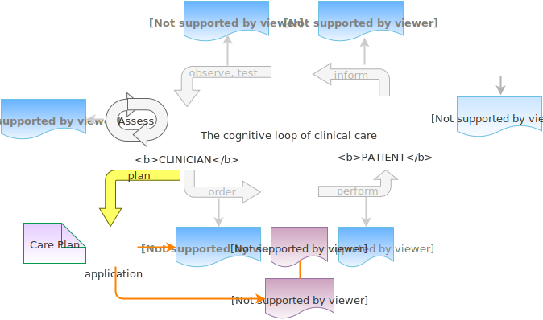
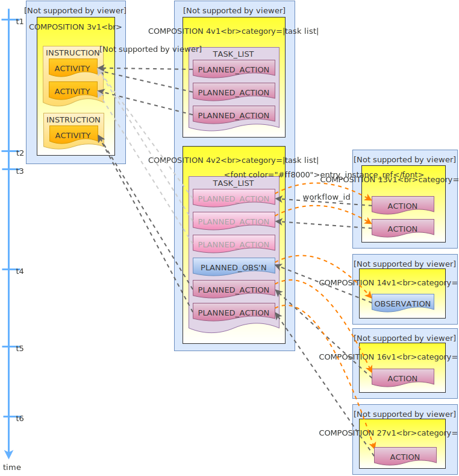

= Task Planning

== Overview

The Entry model described in the previous section defines a way to record clinical statements representing real observations, decisions, orders and actions that have occurred, into the EHR. In this scheme, Actions and Observations represent events that have occurred in the real world - a real drug administration or an actual blood sugar measurement. Instructions represent orders for certain kinds of Actions to be performed. There is however a common additional need to concretely plan Actions and sometimes Observations out in time, as a set of tasks. The general concept is usually known as a _task list_, and is used to concretely specify actions to be performed by actors (usually human, but potentially machine as well) providing care.

To meet this need, a further kind of content can be recorded in the EHR, representing task lists and planned tasks. The design described here considers Task Lists as the lower part of an overall architecture that includes entities at multiple levels, i.e.:

* Care Pathway - a model of a guideline for care of a condition / ideal patient;
* Care Plan - a plan for concrete care of an actual patient, taking into account zero or more Care Pathways and individual specificities;
* Task List - an instance level concept that defines a list of Planned Tasks to perform over time.

We can visualise this conceptually with a modified version of the (<<clinical_investigator_process,Clinical Investigator process diagram>>) as follows:

[.text-center]
.Clinical Investigator Process with Planning

The model described here does not address the representation of the Care Pathway or Care Plan levels, only the Task List level. It does however assume that a Task List may be created due to a Care Plan of some kind, and that the Care Plan may in turn have been derived from one or more Care Pathways or guidelines; accordingly, the means to identify the Plan and Pathway / guideline are provided.

In the following, the term 'Task' or 'Planned Task' denotes the definition of an action to be performed, and is normally documented in openEHR by the `ACTION` Entry subtype. However, 'Task' is understood somewhat more generally, so that it may also when performed, result in an openEHR `OBSERVATION` or other Entry subtype where appropriate. In the great majority of cases therefore, the term 'Task' as it appears here equates to openEHR Actions and Observations.

For the sake of simplicity, 'Action' below is intended to imply an openEHR `ACTION`, `OBSRVATION` or potentially other Entry sub-type, unless otherwise stated.

== Requirements

=== Full Plan

The simplest need is to be able to post a full plan of all Tasks to be performed for an order (represented by an openEHR `INSTRUCTION`), in advance of the order commencing. One difficulty with posting a full plan is that in some cases, the order is effectively open-ended, i.e. it has no intended completion. This might be because the patient condition being treated is chronic, e.g. an insulin or Salbutamol (Ventolin) order; or it might be that although the condition is assumed to be limited in time, no current assumption can be made about when, e.g. pain medication of a trauma victim.

=== Lookahead Plan

A more flexible version of planning an ongoing order is 'lookahead' planning, i.e. posting a plan of Tasks for a moving window in time, e.g. one day, a few days, a few nursing rotations etc. The idea is not to try to plan out the entire order execution, since it can easily change or be stopped, e.g. due to change in patient or other unexpected events. In a lookahead approach, some planned Tasks are executed, and more planned Tasks are added. The planned timing of each set of Tasks may change due to the current situation, with the effect that the overall set of Tasks that unfolds in time may well be different from an attempt to post all Tasks as per the 'full plan' idea.

For the open-ended cases mentioned above, the only option is a lookahead plan that extends as far ahead in time as the treating physicians are prepared to go.

=== Checklist & Sign-off

If a Task list is created, the constituent Tasks can be viewed by workers as a checklist, and subsequently signed off as having been performed over time. The utility of this is that the correspondence between Actions (Observations etc) actually performed and the planned Tasks is established. If a planned Action A1 is posted with execution time T, it might actually be performed at time T', but we still want to know that it was planned Action A1 that was intentionally performed, and not some other Action in the Task list. Over the course of the order execution, a picture will emerge of planned Actions being performed and signed off, possibly with some being missed as not needed, or not done for some other reason. Additional Actions not originally posted in the plan might also be done if they are allowed by the general specification of the relevant archetype.

=== Major Changes and Abandonment

Inevitably, some Task lists will have to be changed or abandoned partway through due to unexpected changes in the patient situation. The question here is: what should be done with the remaining planned Tasks that will not be performed? Should they be marked as 'won't do' (with some reason) and committed to the EHR, or should they be deleted prior to being committed to the EHR?

It is assumed that the answer will differ according to circumstance and local preference, in other words, that planned Tasks that are created are not necessarily written into the EHR, but may initially exist in a separate 'planned tasks' buffer, and are only committed when a) the Task is performed or b) explicitly marked as not done or c) included in a list of not-done Actions to be committed to the EHR at a point of plan abandonment.

[.tbd]
TBD: is a better assumption that whatever planned Tasks have been defined in a Task List represent a clinical intention by the responsible clinicians, and should therefore always go in the EHR? Technically this would be simpler...

=== Support Process Analytics

As Tasks are performed and signed off on the list of posted planned Tasks, there will generally be differences between Actions actually performed and the Tasks on the list. Differences could include:

* time of execution - this will almost always be different, even if only by seconds;
* performer - a Task intended to be performed by a specific type of actor (say a nurse) might be performed by another (say the consultant);
* any other modifiable detail of the order, typically medication dose in bedside care situations.

These differences are recorded in the EHR since both planned Tasks and performed Actions will appear, providing a data resource for analysing business process, order compliance, reasons for deviation and so on.

=== Plans for Order Sets

A plan for a clinical intervention might need to encompass more than one order, in situations where drugs and other therapies are used according to a protocol or regime. For example, in multi-drug chemotherapy based on protocols like CHOP (non-Hodgkin's lymphoma), COPP or Stanford V (Hodgkin's lymphoma) etc, a single drug such as Cyclophosphamide is just a component. A Task list for administering chemotherapy according to a R-CHOP protocol would implicate orders for the drugs  \(R)ituximab, \(C)yclophosphamide, (H)ydroxydaunorubicin, (O)ncovin, and (P)rednisolone or Prednisone, and would accordingly include planned Tasks for each of these drugs as they are administered according to the protocol.

== Design Basis

The design approach adopted here is based on a number of ideas. Firstly, it addresses only the 'Task list' level of the three conceptual levels mentioned earlier, leaving Care Plan and Care Pathway (guideline) to be addressed elsewhere.

=== Phases of Work

The second idea is the notion of three phases of clinical work, namely Order, Planned Task, and (performed) Task. There are correspondingly three levels of representation (two of which already exist in the basic openEHR `ENTRY` model) as follows:

* *Order*: statement of an order, expressed in a formulaic way, e.g. corresponding to "Amoxycillin 3 td po x 7d" (3 times a day, orally, for 7 days)
** represented in openEHR with the `INSTRUCTION` type;
** statement of actions to be performed in the future, usually expressed in a compressed algorithmic way;
* *Planned Task*: representation of a single executable task in the order, to be performed in the future e.g. give Amoxycillin 1 oral tab at lunch;
** statement of each action to be performed in the future, expressed in a direct way as to a performing agent such as the patient or a nurse;
* *Performed Task*: statement of the step that was actually executed by the performer, in the past, e.g. gave Amoxycillin 1 tab at 13:37
** represented in openEHR using the types `ACTION`, `OBSERVATION` etc.
** statement of actions, observations etc that were carried out in the past; may include different details from the Planned Task.

There may be a non-trivial relationship between each form of expression, as suits its different purpose: expressing an order; directing personnel to perform tasks; documenting what was done after the fact.

The model described here adds the second level of representation, which enables fine-grained lists of executable tasks to be explicitly stated and therefore stored in the EHR, displayed, and signed off.

=== Artefact types: Task List and Planned Task

The third element of the design is to define two central artefact types, namely Task List and Planned Task. These follow naturally from the requirements described above, but we need to articulate the semantics of these two concepts, as follows:

* *Planned Task*: a small, separately performable unit of planned work that typically corresponds to:
** the finest level of clinical responsibility, e.g. nurse administration of a drug, single observation of patient vital sign etc;
** the finest level of re-imbursement / billing;
** granularity of check-list and protocol single items, designed to be signed off as performed;
* *Task List*: a logical list of Planned Tasks whose execution is intended to achieve completion of a coarse-grained task or goal, typically an intervention such as a course of medication or other therapy. For example, the Actions to be performed to deliver a course of CHOP / R-CHOP or similar multi-drug chemotherapy that runs over 5 days could be represented as Tasks in a single Task List.
** a Task List is assumed to have a lifecycle that follows the openEHR Instruction State Machine (<<instruction_state_machine,described above>>), and therefore at any time, its state can be computed from the target state and execution status of its constitutent Tasks.

There are a few nuances to consider here. Firstly, the granularity of a Planned Task can be variable, and will tend to follow clinical and health management culture as much as any theoretical precept. For example, healthcare organisation A may regard 'cannula insertion' as a single Task, similar to giving the patient a pill: the nurse just uses his training to perform the job without needing to be reminded of the individual steps. However healthcare organisation B may treat cannulation in a checklist- or guideline-driven way (e.g. using a guideline such as {medscape_cannulation}[this one] from Medscape.com), in which case, a dozen or more Tasks could be defined within a Task List to represent the work. The model described here thus makes no built-in assumptions about granularity of a Task.

=== Relationships between Artefact Types

A final design idea is the flexible relation between a Task List and orders, i.e. `INSTRUCTIONs` in openEHR parlance. In simple cases, a Task List will just be the list of Tasks to fulfill one order, i.e. a single `INSTRUCTION`, such as a prescription for a course of antibiotics. The general case however is that the Task List corresponds to a clinical goal which implicates multiple orders, for example the CHOP chemotherapy mentioned above. 

It may also be the case that _not every Planned Task is associated with an order_. While the typical case is that a Task corresppnds to an openEHR `ACTION` that has not yet been recorded (and which normally has a driving `INSTRUCTION`), it may also correspond to an `ACTION` that has no `INSTRUCTION` or indeed an `OBSERVATION` or possibly an `EVALUATION` (perhaps some kind of check during a procedure). There is also no reason why a Task List cannot consist of Tasks that define administrative work and would be documented with openEHR `ADMIN_ENTRYs`.

We can infer from the above that the main driver of a Task List isn't in general an order, but a guideline or protocol. In simple cases, no formal protocol is used, and the orders (i.e. `INSTRUCTIONs`) may be _de facto_ drivers. At the other extreme, a Task List may be created with no corresponding orders (and therefore `INSTRUCTIONs`) at all.

The following figure shows the correspondences between the various type of openEHR artefact for the general case of Task Lists. The arrows indicate causal relationships.

[.text-center]
.openEHR Planning Artefact Relationships
image::diagrams/planning_artefacts.svg[id=planning_artefact_relationships, align="center", width=50%]

== Task Planning Model

The following figure shows the `rm.composition.planning` package, including its relationships to existing classes.

[.text-center]
.rm.composition.planning package
image::{uml_export_dir}/diagrams/RM-composition.planning.svg[id=rm_composition_planning, align="center"]

The central classes in this model are `TASK_LIST` and `PLANNED_TASK`, which define a list of Tasks and a single Task respectively. 

As stated earlier, the notion of Task in this model is at the bottom of three conceptual levels. Accordingly, it does not attempt to define semantics of Care Plans or Care Pathways, but it does provide attributes to record a guideline and care plan identifier(s) (`PLAN_ITEM._guideline_id_` and `TASK_LIST._care_plan_` respectively).

The abstract parent class `PLAN_ITEM` is used to provide these two classes with various attibutes that may apply both to a list of Tasks and single Task, including:

* `_participations_`: descriptions of participating personnel or devices; since this is included in `PLAN_ITEM` it can be instantiated for the `TASK_LIST` as a whole and/or for individual `PLANNED_TASKs`;
* `_subject_`: indicator of subject of the ask, in the same sense as it is recorded in `ENTRY._subject_`; Void implies subject of the health record;
* `_indications_`: type of patient condition(s) to which this Task applies, e.g. 'pregnancy', 'lymphoma' etc; provided as a patient safety measure e.g. to be displayed in Task list application.

[.tbd]
TBD: is `_indications_` useful?

The `TASK_LIST` class contains its constituent Tasks via the `_tasks_` attribute, and includes other attributes describing the Task List:

* `_description_`: a human-readable description of the Task List, e.g. "R-CHOP chemo administration for patient 384440";
* `_start_time_`, `_completion_timeout_`: respectively start time and maximum time at which the Task List remains valid, i.e. after this time, it is considered 'dead' (this is analagous to the timeout events in the Instruction State Machine);
* `_care_plan_`: a reference to a driving Care Plan within the EHR, if one exists;
* `_guideline_id_`: optional identifier of a driving Care Pathway or other kind of guideline, which may also be recorded in `ENTRY` instances documenting Actions, Observations etc driven by the same guideline;
* `_sm_lifecycle_state()_`: the state machine lifecycle state of the Task List as a whole, computed from the `_sm_target_state_` values of member `PLANNED_TASKs`. The states come from the Instruction State Machine described earlier.

[.tbd]
TBD: how should we best represent `_guideline_id_`? `OBJECT_REF` is the type used in `CARE_ENTRY._guideline_id_`, in the current spec. This was intended to enable the use of a `HIER_OBJECT_ID` or `GENERIC_ID`. However, there is probably no reliable machine identifier system for guidelines or Care Pathways. Perhaps a `DV_IDENTIFIER` would be better - this would allow things like <`_issuer_` = "NICE"; `_id_` = "Sepsis pathway"; `_type_` = "care pathway">.

The `PLANNED_TASK` class includes features common to any kind of Task, including the following:

* `_entry_archetype_ref/entry_archetype_id_`: identifier of archetype for the `ACTION`, `OBSERVATION` or other Entry type that will be created due to this `PLANNED_TASK` being performed; the data of the referenced archetype will normally correspond closely to the data of the `PLANNED_TASK` i.e. due to its own archetype;
* `_entry_template_refs/entry_template_ids_`: an optional attribute whose value if set further constrains which templates of the Entry archetype can be used to record the `ACTION` or other Entry;
* `_entry_archetype_concept_`: the rubric of the root code in the Entry archetype; this provides a human-readable name / semantic type for the `PLANNED_TASK`, for example "medication administration";
* `_cancelled_time_/_cancelled_reason_`: the time and reason the `PLANNED_TASK` was cancelled, if applicable. If a single `PLANNED_TASK` is cancelled, this doesn't necessarily imply anything about the completion of the owning Task list, since a planned Task may have been optional, or otherwise already achieved;
* `_sm_target_state_`: the state machine target state that will be reached if this Task is performed. The states come from the Instruction State Machine described earlier.

[.tbd]
TBD: is there a better way to specify `_entry_template_refs/ids_`?

The class `PLANNED_TASK` will in general be specialised in order to add attributes required by the planned form of specific Entry subtypes, hence, `PLANNED_ACTION`, `PLANNED_OBSERVATION` etc. The `PLANNED_ACION` class contains a number of attributes derived from the `INSTRUCTION` class and its constituent parts, including:

* the `_narrative_` attribute, which is a human-readable copy of the same field from a previously committed `INSTRUCTION` (or potentially derived by computation from items within the relevant `ACTIVITY`);
* the `careflow_step_` attribute, which indicates the step in an archetyped `ACTION` careflow this `PLANNED_ACTION` describes;
* `_instruction_archetype_ref/instruction_archetype_id()_`, identifying the relevant `INSTRUCTION` archetype if any;
* `_instruction_activity_instance_ref_`, described below.

[.tbd]
TBD: `_instruction_archetype_ref/instruction_archetype_id()_` may be redundant; the planning application that creates these structures will know the relevant archetype ids; is there any value in recording them in the `PLANNED_ACTION` instances, especially since they can be determined by following the `_instruction_activity_instance_ref_` reverse runtime ref and looking at the `INSTRUCTION`.

[.tbd]
TBD: The class `PLANNED_TIME` should probably be made generic and added to the BASE component. Needs to take into account some of the other models of time specification.

=== Execution-time Data Structures

Several aspects of how the model above is used at runtime require clarification: the relationship of information objects (`INSTRUCTION`, `TASK_LIST`, `PLANNED_ACTION`, `ACTION` etc) to `COMPOSITIONs` in which they are committed to the EHR, and hence versioning; and logical linking between these items to support workflow traceability. The following figure illustrates both aspects, which are further described below.

[.text-center]
.Runtime planning structures

==== Compositions and Versioning

In this model a `TASK_LIST` is required in order to define any `PLANNED_TASKs`. Accordingly, `TASK_LIST` inherits from `CONTENT_ITEM`, the abstract type of the `_content_` attribute of a `COMPOSITION`. A `TASK_LIST` and its constituent `PLANNED_TASKs` are assumed to be created within a single dedicated `COMPOSITION` which is re-versioned as changes are made to its contents. New versions will occur for the following reasons:

* update / add to `TASK_LIST`, mainly due to extension of the lookahead planning window;
* cancellation of tasks;
* addition of forward references to tasks that have been performed and recorded (i.e. `ACTIONs`, `OBSERVATIONs`, ?`EVALUATIONs` e.g. review); = task item signoff;
* completion or abandonment of the Task list.

As the `TASK_LIST` gets progressively built and performed over time, its owning `COMPOSITION` will potentially undergo numerous versions, corresponding both to changes to the plan, and also execution of the actions performed to fulfill it. When these come to an end, the `TASK_LIST` is deemed 'complete'.

==== Logical Links and Referencing

As described above, there are three possible levels of expression of work items: orders (`INSTRUCTIONs`), Planned Tasks (`TASK_LIST`, `PLANNED_TASK` etc) and performed Tasks (`ACTION`, `OBSERVATION` etc), with the caveat that not every Planned Task or performed Task has an order. To enable workflow traceability, various links can be recorded at runtime, as follows:

* *Planned Task to Order reverse ref*: the `PLANNED_ACTION.instruction_activity_instance_ref` attribute is used to record a reverse reference from a `PLANNED_ACTION` to an `ACTIVITY` within an `INSTRUCTION` that records a corresponding order, if one exists;
* *Planned Task to performed Task forward ref*: the `PLANNED_TASK._entry_instance_ref_` attribute is used to record a forward reference to the Entry instance that was created when this Task was performed, i.e. some `ACTION`, `OBSERVATION` etc;
* *performed Task to Planned Task reverse ref*: the `ENTRY._workflow_id_` attribute may be used to record a reverse reference from an `ACTION`, `OBSERVATION` etc to a causing `PLANNED_TASK` instance.

[.tbd]
TBD: `_entry_instance_ref_` is a forward reference - which requires updating the Task List after the Tasks have beed performed and relevant Entries committed. Is this complication worth the benefit obtained, i.e. directly followable links rather than querying, to find Entries from the Task List items? Is being able to determine the resulting Entries starting from the Task List even useful?

== Scenarios

=== Protocol-driven Plan

The following UML instance diagram shows a partial state of an EHR containing orders and a related Task List. The upper part shows a `COMPOSITION` containing a number of `INSTRUCTIONs` that express the orders for Cyclophosphamide, Hydroxydaunorubicin (Doxorubicin), etc, that make up the order set for a CHOP chemotherapy protocol (to be more complete, Rituximab would also be included). It is assumed that the orders contain the correct dosages for the patient, i.e. that they have been calculated in advance for the patient's body weight, surface area and other specifics. A few elements of an `ACTIVITY` for the Cyclophosphamide drug are shown here.

In the lower part of the part of the diagram is a `COMPOSITION` containing a `TASK_LIST` structure representing the list of work items to perform in order to administer the chemotherapy to the patient. It is assumed that a specialised chemotherapy application has been used to created this structure. The first `PLANNED_ACTION` is shown in some detail, and includes a reference back to the related Instruction Activity, enabling an application to retrieve and display the details of the order. As a precaution, it also has the `_narrative_` attribute set to the value `"Cyclophosphamide 1400 mg IV"`, copied (or generated) from the `INSTRUCTION` when the `TASK_LIST` was created. The other attributes of the `PLANNED_ACTION` object indicate when to execute the Task, what professional role should do it (`_participations_`), the Careflow step ('administer') and the target state machine state (`active`).

Each of the `PLANNED_TASK` instances in the `TASK_LIST` should logically speaking be almost a copy of the `ACTION` that would result from executing the Task. This is not literally true, since there are fields representing various kinds of links, identifiers and other protocol and care plan information, but for the core information of what to do, and when to do it the instance data for a Planned action should be a tight constraint version of the intended Action to result.

[.text-center]
.Typical Task List - CHOP Chemotherapy
image::{uml_export_dir}/diagrams/Planning-typical-instance.svg[id=planning_typical_instance, align="center"]

It is worth considering some of the differences between how an order represents the Task and how it may be represented in a `PLANNED_ACTION` and an eventual `ACTION`. Consider the fourth drug in the CHOP regimen, a choice of Prednisone or Prednisolone. In the form expressed in the order, i.e. the `INSTRUCTION`, it may be expressed in the following form:

* administer 80mg orally every day for 5 days

This could be expressed as a single `ACTIVITY` with the `INSTRUCTION._tming_` attribute set to represent 'once a day for 5 days'.

In the `TASK_LIST` however, it will be expressed as 5 separate `PLANNED_ACTIONs`, each indicating a single dose for one day. This corresponds to how the drug is actually administered and enables the system (and openEHR data) to represent each action individually, as well as deviations such as not performing one or more of the administrations. The information displayed representing each Task to the human agent will therefore be somewhat different to the form in which it is expressed in the generating order.

However, the order `INSTRUCTION` could have been created using a series of 5 `ACTIVITY` objects each representing a single day's administration. In this case, the form defined in each `ACTIVITY` is very close to the form required to represent each Task in the Task list.

It is assumed that determining how to populate the details of the `PLANNED_ACTIONs` is up to an intelligent application that knows the relationship between the relevant orders or order sets, and the exact form of Task lists to implement them.

=== Check-list and Sign-off

[.tbd]
TBD

=== Changes during Execution

[.tbd]
TBD

=== Abandonment

[.tbd]
TBD

== Class Descriptions

include::{uml_export_dir}/classes/plan_item.adoc[]

include::{uml_export_dir}/classes/planned_participation.adoc[]

include::{uml_export_dir}/classes/task_list.adoc[]

include::{uml_export_dir}/classes/planned_task.adoc[]

include::{uml_export_dir}/classes/task_execution_condition.adoc[]

include::{uml_export_dir}/classes/required_status.adoc[]

include::{uml_export_dir}/classes/planned_time.adoc[]

include::{uml_export_dir}/classes/planned_action.adoc[]

include::{uml_export_dir}/classes/planned_observation.adoc[]
