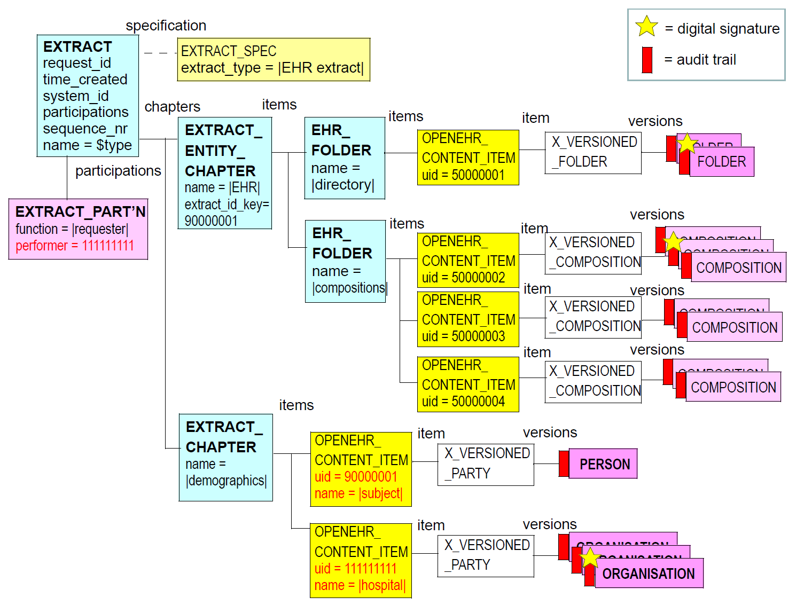

= The openehr_extract Package

== Overview

The `rm.extract.openehr_extract` package defines an openEHR-specific variant of an
`EXTRACT_ITEM`, which consists of a form of the `VERSIONED_OBJECT<T>` class from the rm.common.
`change_control` package suitable for use in Extracts. The Extract form of the class is
`X_VERSIONED_OBJECT<T>`, and consists of attributes which replicate functional values from the
EHR form of the class. This class is further subtyped via binding to non-generic types corresponding
to the top-level object types of the openEHR EHR.

The UML diagram below illustrates the `rm.extract.openehr_extract` package. 

[.text-center]
.rm.extract.openehr_extract Package
image::{uml_export_dir}/diagrams/RM-ehr_extract.openehr_extract.svg[id=rm_openehr_extract, align="center"]

The following figure illustrates a typical instance structure of an EHR Extract.

[.text-center]
.Typical EHR Extract structure

== Design

=== openEHR Extract Item
 
Items from an openEHR sytem included in an EHR Extract are always top-level objects (Composition,
Directory, `EHR_EXTRACT`, `PARTY`, etc, and descendants) are expressed in the serialisable form of
descendants of `X_VERSIONED_OBJECT<T>`. This type provides a standard interoperable way to serialise all or part of `VERSIONED_OBJECTs` for lossless transmission between systems, regardless of the
likely implementation differences in versioning at each end. Accordingly, `X_VERSIONED_OBJECT`
turns most functional properties of `VERSIONED_OBJECT` into data attributes. The two attributes of
most interest are revision_history, which enables the optional inclusion of the complete revision history
from the original `VERSIONED_OBJECT`, and versions, which allows any or all of the versions to
be included form the original. The revision history can be requested on its own using by setting the
`_includes_data_` flag of the version specification to False.

In most scenarios, versions will be included, and revision_history excluded. Each item in
`X_VERSIONED_OBJECT`.`_versions_` consists of a wrapped copy of an `ORIGINAL_VERSION` from the
corresponding `VERSIONED_OBJECT` object in the source system.

=== EHR Extract Structure

The overall structure of the openEHR EHR for a subject can be replicated with an archetyped Folder
structure that creates the groupings of directory, compositions, ehr_access, and ehr_status that are
found in an openEHR EHR. This use of folders is not mandatory, but is likely to be useful in most
cases, and is the structure shown in the figure <<typical_extract_structure>> above.

=== Demographic Referencing

Within the content an EHR Extract, wherever `PARTICIPATION` and `PARTY_PROXY` structures occur
(for the latter, the `PARTY_SELF` and `PARTY_IDENTIFIED` descendants), they are preserved intact,
for reasons of fidelity. However, the final 'pointer', i.e. the `OBJECT_ID`.`_value_` may be rewritten
within the Extract to correctly refer to the intended demographic. A typical `S_PARTICIPATION`
structure is illustrated at the bottom of the figure <<typical_extract_structure>>. In this figure, the `OBJECT_ID`.`_value_` has been
rewritten to refer to the uid (11111111) of the first `OPENEHR_CONTENT_ITEM` object shown in the figure.

== Class Descriptions

include::{uml_export_dir}/classes/openehr_content_item.adoc[]

include::{uml_export_dir}/classes/x_versioned_object.adoc[]

include::{uml_export_dir}/classes/x_versioned_ehr_access.adoc[]

include::{uml_export_dir}/classes/x_versioned_ehr_status.adoc[]

include::{uml_export_dir}/classes/x_versioned_composition.adoc[]

include::{uml_export_dir}/classes/x_versioned_folder.adoc[]

include::{uml_export_dir}/classes/x_versioned_party.adoc[]
