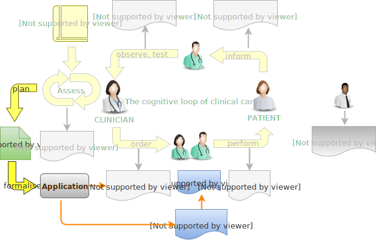

= Design Principles

The design approach adopted here is based on a number of ideas. Firstly, it addresses only the 'Task Plan' level of the three conceptual levels mentioned earlier, leaving Care Plan and Care Pathway (guideline) to be addressed elsewhere. The other design elements are described below.

== Conceptual Basis: Work Plan and Task Plan

This specification takes the approach that a 'Task Plan' (or 'Plan', for short), is a set of Tasks designed to achieve a particular outcome for a single subject of care, generally a single patient. It may have one or more performers, depending on whether a team is needed. It may also be composed of sub-plans, represented as other Task Plans. Since the work that multiple performers may be definable in a standalone sense (e.g. scans, tests, routine procedures such as IV catheterisation), but also used together in a guideline or pathway-based larger plan, such as stroke management, it is assumed that in general, more than one concrete 'Plan' may be collected together to achieve an overall plan intention. This construct is known here as a 'Work Plan'.

A Work Plan is a high-level construct that groups together Task Plans, includes descriptive meta-data, and can be used by the Plan execution engine to determine the overall state of progress on the Plan.

Most of this specification focuses on the Task Plan, which is where the primary representation of the tasks sits.

=== Fractal Structure

In the real world, almost every Task can be sub-divided into a smaller set of Tasks. In addition, some sets of Tasks can be performed without regard to order - i.e. in parallel - while others must be ordered. This specification accordingly supports this hierarchical structure via three structural artefacts, namely Task Plan, Task Group and Task. These follow naturally from the requirements above, but we need to articulate the semantics of these concepts, as follows:

* *Task*: a small, separately performable unit of planned work that typically corresponds to:
** the finest level of clinical responsibility, e.g. nurse administration of a drug, single observation of patient vital sign etc;
** the finest level of re-imbursement / billing;
** granularity of check-list and protocol single items, designed to be signed off as performed;
** a particular planned time of execution;
* *Task Group*: a group of Tasks within a Task Plan that are to be executed on some basis, e.g. sequential, parallel;
* *Task Plan*: a logical set of Tasks contained in a top-level Task Group, whose execution is intended to achieve completion of a coarse-grained task or goal with respect to a particular subject of care, typically an intervention such as a course of medication or other therapy. The top-level Task Group may contain further nested Task Groups. Task Plans are a unit of reuse.
* *Work Plan*: top-level structure containing all Task Plans needed to implement the intended specific outcome for a subject.
** Any Task Group or Task may be marked as optional or mandatory for execution.
** Since a Task Plan is intended to achieve a purpose, it is assumed to have a _lifecycle_ whose states indicate where its execution is with respect to the outcome. In fact, the lifecycle has to be tracked on a runtime version of the Task, with the definition of the Task only being able to record snapshot states from the runtime instantiation. See below for a full explanation of the Task Plan lifecycle.
** It is assumed that any number of Task Plans could be active for a given subject of care at a given moment.

The consequence of the above is that a Task Plan is in general a hierarchical structure consisting of Task Group nodes and Task leaves. This enables grouping of particular Task subsets, and also the fine-grained specification of execution ordering.

== Levels of Model Definition

In common with typical workflow systems, this specification recognises three levels of planned task model, as follows:

* _templated definition_: a Task Plan template is a definition of a Task Plan that may be used in multiple situations, where local modifications may be made; it is represented in the form of openEHR templated archetype(s);
* _specific definition_: when a Task Plan templated archetype is instantiated, the result is understood as the _definition_ of the Task Plan to be used in a specific circumstance; any modifications allowed by the archetypes may be made to achieve the specific Task Plan needed;
* _runtime instantiation_: at execution time, a Task Plan definition will be wholly or partly instantiated, along with execution state specific to the 'run', i.e. the session during which some or all of the Task Plan might be performed.

In this scheme, archetypes and templates conveniently achieve the 'template' or 'prototype' level of definition that is needed to support standard models of similar but not identical kinds of Task Plan. For example, a single set of archetypes and templates could be used to represent Task Plans for hospital drug administration.

== Principal Performer

All Tasks in a Plan are defined to have a _principle performer_, that is to say, a single logical actor. This is often a single person (or a device or possibly a software service, e.g. a CDS model of which questions can be asked), but might equally be a group of personnel, e.g. ward nurses, who execute the steps of a Task Plan during and across shift boundaries (wound dressing, turning patients, IV maintenance etc). In these cases there is an understanding by separate individuals that they constitute a common workforce with respect to the subject of care, for any given planned piece of work.

The principal performer can accordingly be specified in terms of professional roles, and optionally a specific agent. This might even in some cases be the patient.

The principle performer is for practical reasons defined to be on a Task Group in the model. This enables a Task Plan by default to have a single principle performer attached to the top-level Task Group, but to be overridden at lower level Groups.

In addition to the principal performer, other participations can be specified for any contained Task in a Plan. However it is assumed that the principal performer is _responsible_ for all actions, and is also the notifier of action completions and cancellations, as well as the target of notifications to do with linked Task Plans.

The consequences of this design principle are twofold:

* where a team of executing actors is required to perform a logical procedure, _a Plan may have more than one principal performer in different Group sections, or alternatively, each distinct actor has his or her own Task Plan_;
* for a team to operate together, coordination is required between the Task Plans and relevant actors. This is described below in more detail.

== Phases of Work

This design uses the notion of three potential phases of clinical work, namely 'ordering', 'planning', and 'performing'. Orders are a common way to generate tasks, but are not the only way, and many tasks are generated from a protocol or guideline or _ad hoc_. Corresponding to these phases, there are three possible levels of representation, the first and last of which already exist in the basic openEHR `ENTRY` model, as follows:

* *Order*: statement of an order, if one exists, expressed in a _formulaic_ way, e.g. corresponding to "Amoxicillin 3 times a day, orally, for 7 days";
** represented in openEHR with the `INSTRUCTION` type;
** statement of order-related actions to be performed in the future, usually expressed in a compressed algorithmic way that requires further interpretation by the performing agent to determine when individual actions occur and their details;
* *Planned task*: representation of a single executable task in the order, to be performed in the future e.g. 'give 1 Amoxycillin oral tab at lunch';
** statement of each action to be performed in the future, expressed in a direct way as to a performing agent such as the patient or a nurse;
* *Performed task*: statement of the action that was actually executed by the performer, in the past, e.g. 'gave 1 Amoxycillin tab at 13:37';
** represented in openEHR using the types `ACTION`, `OBSERVATION` etc.
** statement of actions, observations etc that were carried out in the past; may include different details from the Planned task.

There may be a non-trivial relationship between each form of expression, as suits its different purpose: expressing an order; directing personnel to perform tasks; documenting what was done after the fact.

The model described here adds the second level of representation, which enables fine-grained lists of executable tasks to be explicitly stated and therefore stored in the EHR, displayed, and signed off.

We can visualise this conceptually with a modified version of the {openehr_rm_ehr}#clinical_investigator_process[Clinical Investigator process diagram] as follows:

[.text-center]
.Clinical Investigator Process with Planning

According to this scheme, `TASK_PLAN` and `TASK` are new types of information that can be committed to the EHR.

== Separation of Task Definition and Execution State

A Task Plan is essentially a definition of work to be done, or more precisely, an _instance_ of a definition of work. When the work has been performed, the results are documented with openEHR Entries, such as Actions and Observations. However, there is usually a need to track the progress of the work between commencement and completion (or cancellation). Based on the model, it is possible to track:

* Task execution events, which can be understood as state transitions in a notional state machine with states such as 'planned', 'completed', 'cancelled' etc;
* Notifications to other actors of Task events, usually completion;
* Receipt of notifications from other actors, which enable waiting Task(s) to proceed.

It would in theory be possible to track state by representing it in the Task Plan _definition_, and relying on versioning of successive commits of each update to provide the execution picture over time. However, this is not likely to correspond to the needs of the EHR, or workflow processing that occurs as the work is performed. In the former case, the execution of a non-trivial Task Plan may result in hundreds of state changes, notifications, etc, which will result in a similar number of commits to the EHR. This may be mitigated by only committing at certain points in time, but then the history of progress is lost.

On the other hand, a workflow application whose job is to use Task Plans to support work being undertaken by clinical personnel needs to carefully track the history of updates, in order to know which Tasks have been done, and which have not. Since this will often occur over multiple work shifts and/or long periods (up to two weeks for some chemotherapy), persistence is required.

The approach taken is therefore to include two runtime representations of a Work Plan and its Task Plans. The first is known as the 'materialised' form, which is an instance representation used _during_ execution.

The second runtime-related representation in the model is an explicit 'execution history', consisting of every change event during progress of the work. This history can be attached to the Task Plan, and represents an after-the-fact view of execution - something like a specialised execution log.
